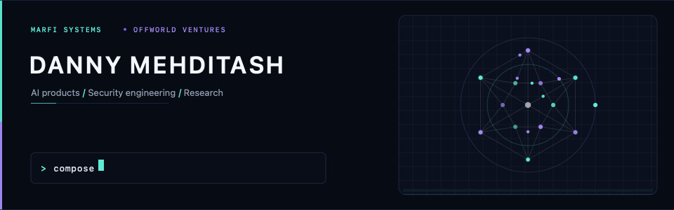
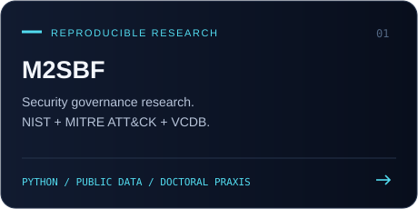
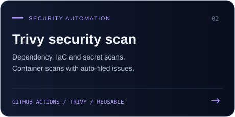

  

  
  
  
  

## The work

I build AI products, automate operations, and work on the security behind them.

- **MARFI Systems:** Co-Founder. AI-native managed IT, cybersecurity, and compliance.
- **Offworld Ventures:** My AI venture studio.
- **Research:** Doctoral candidate at George Washington University, working on security governance for small and mid-sized businesses.

## Selected public work

  
  

### M2SBF | Modern Modular Secure Business Framework

A public research package supporting my doctoral praxis. It joins security-control and threat data to study how small and mid-sized businesses can prioritize security modules.

- Version-pinned, hash-verified inputs from NIST SP 800-53 OSCAL, CTID, MITRE ATT&CK, and VCDB.
- Python standard library only, with tests and deterministic-output checks in GitHub Actions.
- [Explore the repository](https://github.com/dr-danny/M2SBF) · [Archived release on Zenodo](https://doi.org/10.5281/zenodo.23076620)

### Trivy security scan | Reusable security automation

A shared GitHub Actions workflow for dependency, infrastructure-as-code, secret, and container scanning, with auto-filed security issues.

- Reusable across MARFI Systems, Offworld Ventures, and my personal repositories.
- [Explore the workflow](https://github.com/MARFI-Systems/trivy-security-scan)

## Tools in the public work

  
  
  
  
  

## Find me

- **MARFI:** [marfi.ai](https://marfi.ai) · [GitHub organization](https://github.com/MARFI-Systems)
- **Offworld:** [GitHub organization](https://github.com/Offworld-Ventures)
- **Contact:** [LinkedIn](https://www.linkedin.com/in/al3d1n/) · [danny@marfi.io](mailto:danny@marfi.io)
