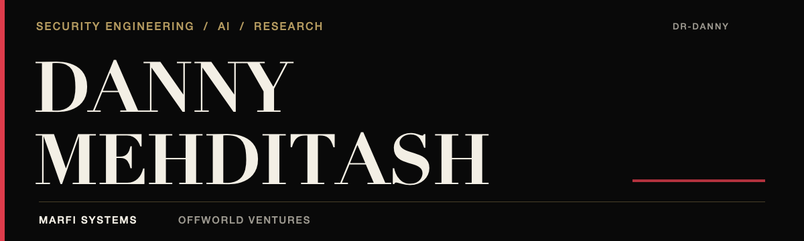
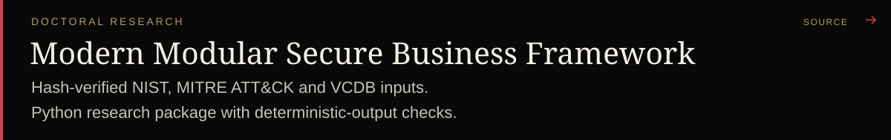
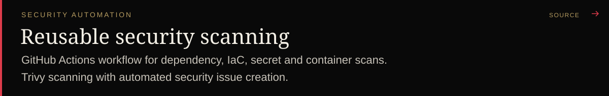
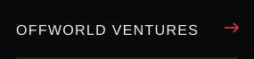

- **Co-Founder, MARFI Systems.** Managed IT, cybersecurity, and compliance.
- **Offworld Ventures.** AI products and venture studio.
- **Doctoral candidate, George Washington University.** Security governance for small and mid-sized businesses.

 

### Selected public work

[Research archive](https://doi.org/10.5281/zenodo.23076620)

 

