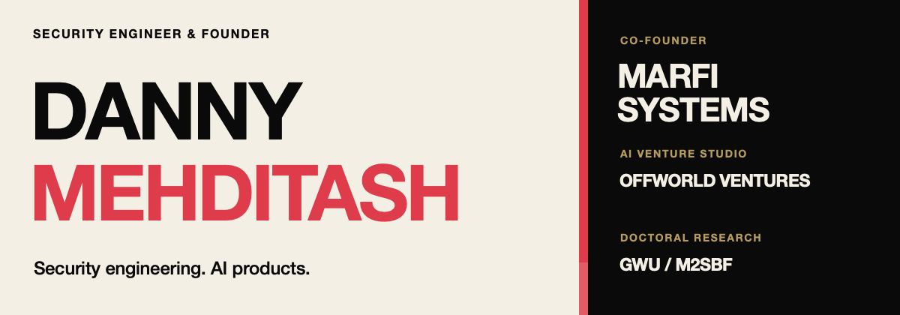
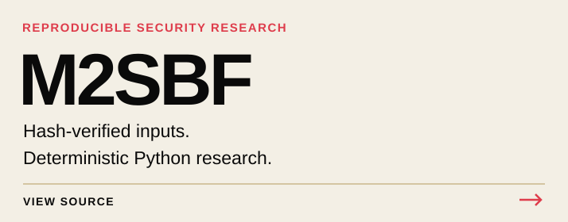
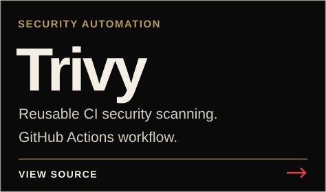

### Selected work

[MARFI](https://marfi.ai) &nbsp; / &nbsp; [Offworld](https://github.com/Offworld-Ventures) &nbsp; / &nbsp; [LinkedIn](https://www.linkedin.com/in/al3d1n/) &nbsp; / &nbsp; [Email](mailto:danny@marfi.io) &nbsp; / &nbsp; [Research archive](https://doi.org/10.5281/zenodo.23076620)
